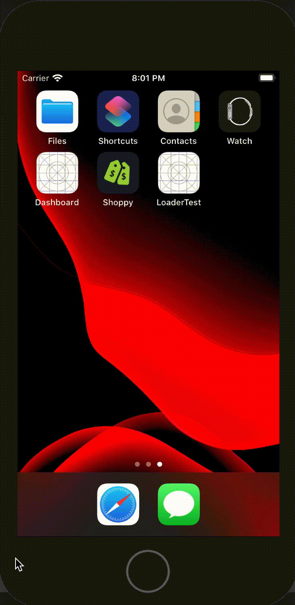

# Swloader
> Swloader is a simple and very simple to use activity loader in SwiftUI. UIKit is almost not used, only for managing the translucent background.

## Screenshots
| Loader | Loader with legend | Icon with legend | 
|:------:|:------------------:|:----------------:|
|  |  | 

## Installation
Swloader can be installed using Swift Package Manager. In Xcode, go in `File` > `Swift Packages` > `Add Package Depencency...`.
Then type this URL: `https://github.com/vlourme/Swloader`.

## How to use
Swloader is based on a ViewModifier, so you just need to add a modifier to your rootView. Here is an example:

```swift
@State private var showLoader: Bool = true

VStack {
    // content
}
.showLoader(isPresented: $showLoader)
```

## Customize
Display a legend:
```swift
.showLoader(isPresented: .constant(true), label: "My legend here")
```

Show an icon (SF Symbols) instead of the loading circle:
```swift
.showLoader(isPresented: .constant(true), icon: "wifi")
```

Both icon and legend can be combined.